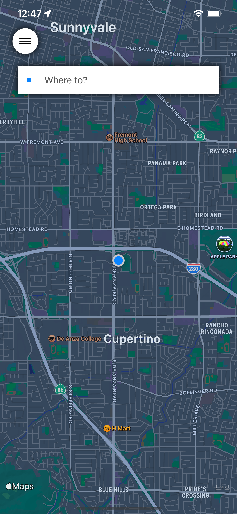
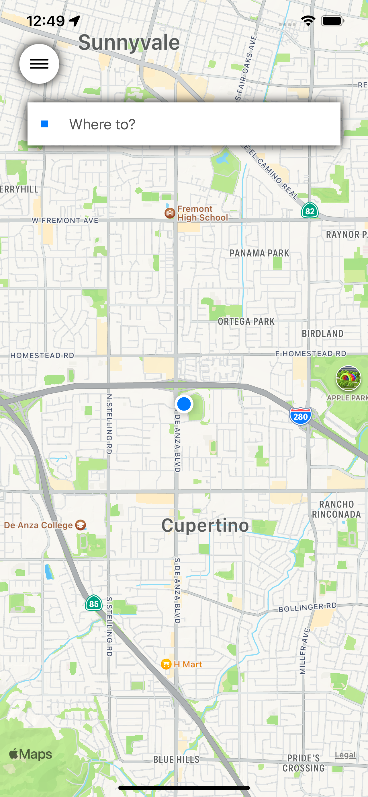
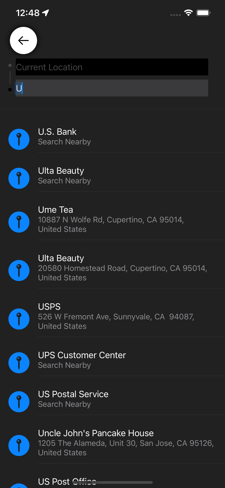
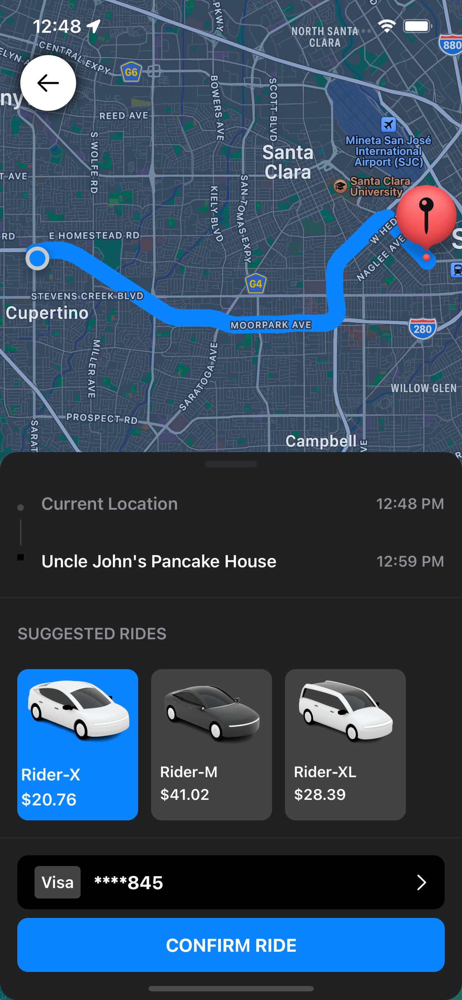

# Ride App

This is a ride selecting and booking application which is simillar to Uber, PickMe implemented using SWIFT UI and MapKit API.

**Xcode version:** 14.2 (14C18)

## **Previews**

<table>
<tr>
  <th>
    App Preview
  </th>
  <th>
    Home Page - Dark mode
  </th>
  <th>
    Home Page - Light mode
  </th>
  <th>
    Location Selection View - Dark mode
  </th>
  <th>
    Ride Selection View - Dark mode
  </th>
</tr>
<tr>
  <td>
     
  </td>
  <td>
     
  </td>
  <td>
    
  </td>
  <td>
    
  </td>
  <td>
    
  </td>
</tr>
</table>

